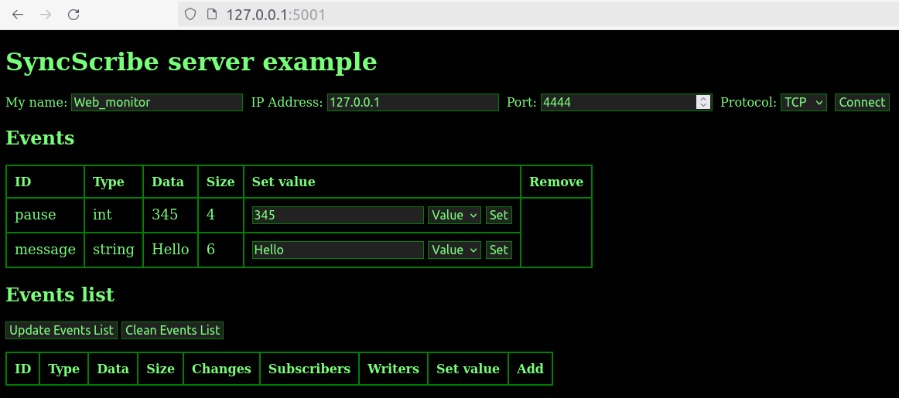
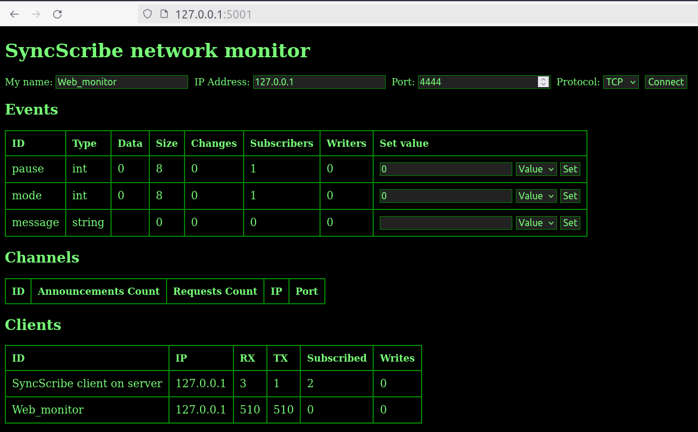

SyncScribe Library
===================

Overview
--------

SyncScribe is a powerful and versatile library designed to facilitate real-time communication and synchronization between clients using a server-based or P2P architecture. It enables clients to send and receive events, messages, variables, streams, and large data, ensuring all subscribed clients are kept up-to-date with the latest information. SyncScribe is particularly useful in applications requiring real-time data synchronization, such as collaborative tools, embedded systems, and IoT. Integrated cryptographic functions provide secure connections between clients.

The SyncScribe server is implemented as part of the library and can be started as a standalone application (recommended for safety reasons) or integrated into the user application. The library includes a Python wrapper that supports full client functionality. Additionally, SyncScribe comes with a Python-based web server application to monitor and make changes.

SyncScribe provides a comprehensive set of functions for real-time communication over TCP, UDP, and ICMP protocols, making it an ideal choice for embedded systems. The library supports the SSDP protocol, allowing clients to connect without needing to know the server configuration. The server/client code has a minimal footprint, has been certified, and is widely used in various internal projects to provide an easy communication and synchronization channel between applications located on a local PC or across a network.

The library creates a thread where it handles connections, connection errors, restores connections, and receives messages. User applications don't need to worry about reconnections or errors; the library will try to reconnect in the background automatically.

SyncScribe provides two ways to process events: fast asynchronous and slower synchronous. In asynchronous mode, events trigger callbacks immediately after receiving a packet. The user application should perform quick actions and return from the callback. In synchronous mode, event data is stored in internal memory and can be read at any moment.

Events have a sync mode that allows callbacks to be executed on many PCs simultaneously (NTP support required).

Road-map
--------

- Write the description, test encription functions
- Windows clients support
- Support synchronization between many independent servers
- Support multi-servers mode for clients

Build
-----

$ sudo apt install json-c
$ make

Python web server support
-------------------------

TODO

Installation
------------

TODO

Directory description
---------------------

TODO

Client Features and Functions: Connection Management API
---------------------------------------------------------

syncs_connect: Establishes a connection to the server at the specified address and port, using a unique client ID. A callback function can be provided to handle connection events.

syncs_connect_simple: Simplifies the connection process by omitting the callback function.

syncs_udpconnect: Establishes a UDP connection to the server.

syncs_isconnect: Checks if the client is currently connected to the server.

syncs_connect_status: Retrieves the current connection status and server ID.

syncs_connect_wait: Waits for the connection to be established within a specified timeout period.

syncs_disconnect: Disconnects the client from the server.

Client Features and Functions: Discovery API
--------------------------------------------

syncs_find_server: Finds a server over SSDP prtocol and retrieves its address and port.

Client Features and Functions: Event Subscription and Management API
--------------------------------------------------------------------

syncs_define: Defines a new event or variable on the server.

syncs_undefine: Undefines an existing event or variable.

syncs_subscribe_event: Subscribes to an event with a callback function to handle event notifications.

syncs_subscribe_event_sync: Synchronously subscribes to an event without using a callback.

syncs_subscribe_event_sync_user: Synchronously subscribes to an event by using user buffer to store data event.

syncs_unsubscribe_event: Unsubscribes from a previously subscribed event.

Client Features and Functions: Event Handling API
-------------------------------------------------

syncs_wait_event: Waits for an event to occur within a specified timeout period. Returns the event ID and associated data.

Client Features and Functions: Data Reading
-------------------------------------------

syncs_read: Reads data associated with an event or variable.

syncs_read_int32, syncs_read_int64: Reads integer values (32-bit and 64-bit respectively).

syncs_read_float, syncs_read_double: Reads floating-point values.

syncs_read_str: Reads string values.

Client Features and Functions: Data Writing
-------------------------------------------

syncs_write: Writes data associated with an event or variable.

syncs_write_int32, syncs_write_int64: Writes integer values (32-bit and 64-bit respectively).

syncs_write_float, syncs_write_double: Writes floating-point values.

syncs_write_str: Writes string values.

syncs_write_event: Triggers an event on the server.

Client Features and Functions: Clients and Event Information
------------------------------------------------------------

syncs_request_clientslist: Requests a list of currently connected clients.

syncs_request_eventslist: Requests a list of available events.

syncs_request_channelslist: Requests a list of available channels.

syncs_free_eventslist, syncs_free_clientslist, syncs_free_channelslist: Frees the memory allocated for event, client, and channel lists.

Client Features and Functions: Channel Management
-------------------------------------------------

syncs_channel_anons: Announces a new channel with the specified ID and port.

syncs_channel_request: Requests access to a channel using its ID.

Client usage scenarios
---------------

- Case 1: Connect to unknow server over tcp protocol and write a value:

syncs_connect_simple (NULL, 0, client_name)
while (1) {
    syncs_write_int32(event_ID_0)
}

- Case 2: Connect to know server over tcp protocol subscribe to async event:

syncs_connect_simple (server_ip, server_port, client_name)
syncs_subscribe_event(event_ID_0, Callback_0)
while (1) {
    do_something_0()
}

Callback_0() {
    do_something_1()
}

- Case 3: Connect to know server over tcp protocol subscribe to async events and write :

syncs_connect_simple (server_ip, server_port, client_name)
syncs_subscribe_event (event_ID_0, Callback_0)
syncs_subscribe_event (event_ID_1, Callback_1)
syncs_subscribe_event (event_ID_2, Callback_1)

while (1) {
    do_something_1()
    syncs_write_int32(event_ID_2)
}

Callback_0() {
    do_something_2()
}

Callback_1() {
    do_something_3()
}

- Case 4: Connect to know server over tcp protocol subscribe to sync events:

syncs_connect_simple (server_ip, server_port, client_name)
syncs_subscribe_event_sync(event_ID_0)
syncs_subscribe_event_sync(event_ID_1)

while (1) {
    syncs_wait_event ()
    case event_ID_0: do_something_0()
    case event_ID_1: do_something_1()
}

Server Features and Functions: creating and Managing Servers API
----------------------------------------------------------------

syncs_server_create: Creates a server instance with the specified address, port, and ID, allowing it to handle client connections and data synchronization.

syncs_server_ssdp_create: Creates an SSDP (Simple Service Discovery Protocol) instance for the server, enabling the server to advertise its presence and allow clients to discover it automatically.

syncs_server_stop: Stops the server, terminating all connections and halting its operations.

Server Features and Functions: Defining and Undefining Events or Variables
--------------------------------------------------------------------------

syncs_server_define: Defines a new event or variable on the server, specifying its type and initial data. This function is essential for setting up the events or variables that clients will interact with.
syncs_server_undefine: Undefines an existing event or variable on the server, removing it from the server's registry.

Server Features and Functions: Subscribing and Unsubscribing to Events
----------------------------------------------------------------------

syncs_server_subscribe_event: Subscribes to an event on the server with a callback function, allowing the server to handle event notifications and execute specified actions when the event occurs.
syncs_server_unsubscribe_event: Unsubscribes from an event on the server, stopping the server from handling notifications for that event.

Server Features and Functions: Reading Data
-------------------------------------------

syncs_server_read: Reads data associated with an event or variable from the server.
syncs_server_read_int32: Reads a 32-bit integer value associated with an event or variable from the server.
syncs_server_read_int64: Reads a 64-bit integer value associated with an event or variable from the server.
syncs_server_read_float: Reads a floating-point value associated with an event or variable from the server.
syncs_server_read_double: Reads a double-precision floating-point value associated with an event or variable from the server.
syncs_server_read_str: Reads a string value associated with an event or variable from the server.

Server Features and Functions: Writing Data
--------------------------------------------

syncs_server_write: Writes data associated with an event or variable to the server.
syncs_server_write_int32: Writes a 32-bit integer value associated with an event or variable to the server.
syncs_server_write_int64: Writes a 64-bit integer value associated with an event or variable to the server.
syncs_server_write_float: Writes a floating-point value associated with an event or variable to the server.
syncs_server_write_double: Writes a double-precision floating-point value associated with an event or variable to the server.
syncs_server_write_str: Writes a string value associated with an event or variable to the server.

Server Features and Functions: Debugging
----------------------------------------

syncs_server_print_event: Prints the event information to the specified stream, providing a way to log or debug the events handled by the server.

Perfomance Tests
----------------

TODO

Alexander Krapivniy (a.krapivniy@gmail.com)
